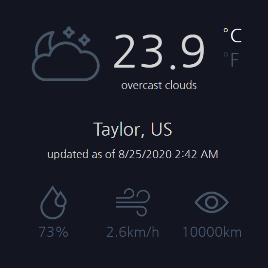

This project is part of the <a href="https://www.freecodecamp.org/learn/coding-interview-prep/take-home-projects/show-the-local-weather" target="_blank">FreeCodeCamp</a> Web Development program.
## Weather-app
A browser responsive weather app built with React. Click <a href="https://cdngouma.github.io/weather-app/" target="_blank">here</a> for a demo.

